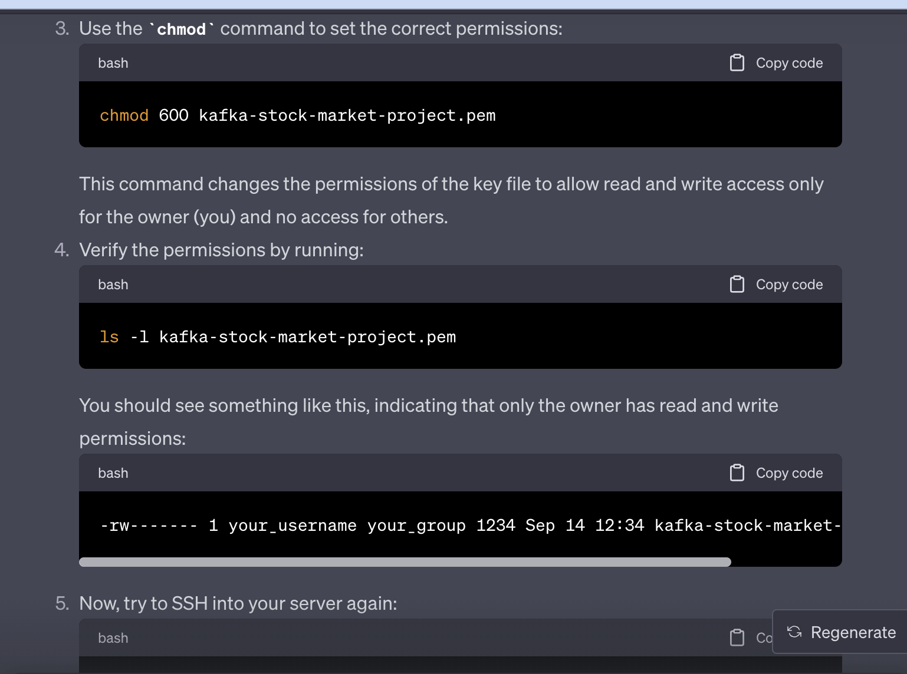

# Stock-Market-Real-Time-Data-Analysis-Using-Kafka

- Follow the video, for ssh , change the permission




- we should paste some commands in the terminal, link to the commands is given below
    - https://github.com/darshilparmar/stock-market-kafka-data-engineering-project/blob/main/command_kafka.txt

- use the below command to download the kafka, as the one in the video is not working
    - `wget https://downloads.apache.org/kafka/3.5.1/kafka_2.12-3.5.1.tgz`
    - make sure to download the kafka_2.12-3.5.1.tgz file, and not the src file, you shoul download the binary file
    - `tar -xvf kafka_2.12-3.5.1.tgz `
- https://kafka.apache.org/quickstart link to kafka quickstart

- Apache Kafka runs on top of JVM, so we need to install java 
    - `sudo nano /etc/yum.repos.d/corretto.repo`
    - Add the following lines to the file
    ```
    [corretto]
    name=Corretto repository
    baseurl=https://yum.corretto.aws/corretto/latest/$releasever/generic/x86_64/
    enabled=1
    gpgcheck=1
    gpgkey=https://yum.corretto.aws/corretto.key
    ```
    ```
    sudo yum install java-1.8.0-amazon-corretto-devel
    java -version

    ```

- now we need to start the zookeeper server
    - `cd kafka_2.12-3.5.1/`
    - `bin/zookeeper-server-start.sh config/zookeeper.properties`
- keep the above terminal open, and open a new terminal
- now 
    - `export KAFKA_HEAP_OPTS="-Xmx256M -Xms128M"`
    - the above command is to set the heap size, as we are running kafka on a single node, we need to set the heap size
    - lets start the kafka server 
    - `cd kafka_2.12-3.5.1/`
    - `bin/kafka-server-start.sh config/server.properties`
- but the above command will not work, as the ip set in the server.properties file is not the ip of the machine, so we need to change the ip in the server.properties file
    - stop both the zookeeper and kafka server by pressing ctrl+C.
    - `sudo nano config/server.properties`
    - change the ip to the public ip of the ec2 machine.
    - press ctrl+X, then press Y, then press enter
    - `bin/kafka-server-start.sh config/server.properties`

- now go to ec2 instance, click on the `security group`, then click on the `inbound rules`, then click on `edit inbound rules`, then click on `add rule`, then select the type as `all traffic`, then select the source as ` AnyWhere IPv4`, then click on `save rules`

- now open new terminal, and ssh into the ec2 instance
    - lets create a topic
    - `cd kafka_2.12-3.5.1/`
    - `bin/kafka-topics.sh --create --topic demotest --bootstrap-server 52.64.233.47:9092 --replication-factor 1 --partitions 1`
    - WARNING: Due to limitations in metric names, topics with a period ('.') or underscore ('_') could collide. To avoid issues it is best to use either, but not both.
    - you can ignore the above warning
    - `Created topic demotest.`

    - now we need to start the producer, so that we can send the data to the topic
    - make sure to keep the topic name same as the one you created above
    - `bin/kafka-console-producer.sh --topic demotest --bootstrap-server 52.64.233.47:9092`
    - we can do this in the same window where we creaed the topic