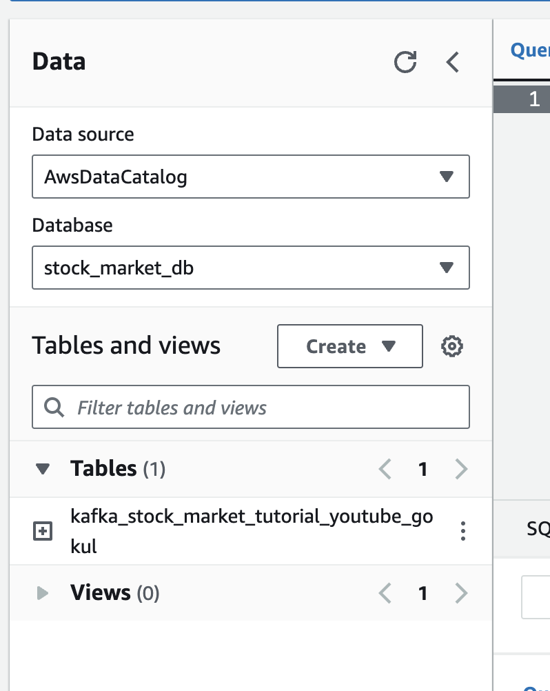

# Stock-Market-Real-Time-Data-Analysis-Using-Kafka
- https://www.youtube.com/watch?v=KerNf0NANMo

- Follow the video, for ssh , change the permission


- we should paste some commands in the terminal, link to the commands is given below
    - https://github.com/darshilparmar/stock-market-kafka-data-engineering-project/blob/main/command_kafka.txt

- use the below command to download the kafka, as the one in the video is not working
    - `wget https://downloads.apache.org/kafka/3.5.1/kafka_2.12-3.5.1.tgz`
    - make sure to download the kafka_2.12-3.5.1.tgz file, and not the src file, you shoul download the binary file
    - `tar -xvf kafka_2.12-3.5.1.tgz `
- https://kafka.apache.org/quickstart link to kafka quickstart

- Apache Kafka runs on top of JVM, so we need to install java 
    - `sudo nano /etc/yum.repos.d/corretto.repo`
    - Add the following lines to the file
    ```
    [corretto]
    name=Corretto repository
    baseurl=https://yum.corretto.aws/corretto/latest/$releasever/generic/x86_64/
    enabled=1
    gpgcheck=1
    gpgkey=https://yum.corretto.aws/corretto.key
    ```
    ```
    sudo yum install java-1.8.0-amazon-corretto-devel
    java -version

    ```

- now we need to start the zookeeper server
    - `cd kafka_2.12-3.5.1/`
    - `bin/zookeeper-server-start.sh config/zookeeper.properties`
- keep the above terminal open, and open a new terminal
- now 
    - `export KAFKA_HEAP_OPTS="-Xmx256M -Xms128M"`
    - the above command is to set the heap size, as we are running kafka on a single node, we need to set the heap size
    - lets start the kafka server 
    - `cd kafka_2.12-3.5.1/`
    - `bin/kafka-server-start.sh config/server.properties`
- but the above command will not work, as the ip set in the server.properties file is not the ip of the machine, so we need to change the ip in the server.properties file
    - stop both the zookeeper and kafka server by pressing ctrl+C.
    - `sudo nano config/server.properties`
    - change the ip to the public ip of the ec2 machine.
    - press ctrl+X, then press Y, then press enter
    - `bin/kafka-server-start.sh config/server.properties`

- now go to ec2 instance, click on the `security group`, then click on the `inbound rules`, then click on `edit inbound rules`, then click on `add rule`, then select the type as `all traffic`, then select the source as ` AnyWhere IPv4`, then click on `save rules`

- now open new terminal, and ssh into the ec2 instance
    - lets create a topic
    - `cd kafka_2.12-3.5.1/`
    - `bin/kafka-topics.sh --create --topic demotest --bootstrap-server {ipaddr}:9092 --replication-factor 1 --partitions 1`
    - WARNING: Due to limitations in metric names, topics with a period ('.') or underscore ('_') could collide. To avoid issues it is best to use either, but not both.
    - you can ignore the above warning
    - `Created topic demotest.`

    - now we need to start the producer, so that we can send the data to the topic
    - make sure to keep the topic name same as the one you created above
    - `bin/kafka-console-producer.sh --topic demotest --bootstrap-server {ipaddr}:9092`
    - we can do this in the same window where we creaed the topic

    - now we need to start the consumer, so that we can receive the data from the topic
    - make sure to keep the topic name same as the one you created above
    - `bin/kafka-console-consumer.sh --topic demotest --bootstrap-server {ipaddr}:9092`
    - we can do this in the same window where we creaed the topic

- now we can send the data from the producer to the consumer
- we can send the data from the producer to the consumer, by typing the data in the producer terminal, and then pressing enter
    - try 'hello world' in the producer terminal, and then press enter
    - you should see the same in the consumer terminal


- checkout the producer and consumer ipynb files

- now lets create a bucket in s3
    - go to s3 console
    - click on create bucket
    - give a name for bucket that is unique throughout everyone
    - click on create

- lets learn about S3 bucket
    - https://www.youtube.com/watch?v=3hLmDS179YE
    - s3 bucket is a storage service provided by aws
    - s3 bucket is a object storage service
    - s3 bucket is a flat file storage service 
    - it is widely used for storing images, videos, documents, etc


- we need to upload data from our local machine to s3 bucket

- let get to producer ipynb file and add the code for that

- we also have to configure aws in our local machine
    - go to iam in aws console
    - if mfa (multi-factor-authentication ) is not enabled, enable it, I use microsoft authenticator app
    - then click on users and Create user
    - NOTE : while setting permissions , click attach existing policies directly, and then search AdministratorAccess, and then click on AdministratorAccess, and then click on next, and then click on create user
    - it will ask for programmatic access, click on that, and then click on next, and then click on create user
    - now you will see the access key id and secret access key, copy them and paste them in the producer ipynb file
    - Also download the csv file, and paste the path of the csv file in the producer ipynb file, its important to keep the file safe 
    - now we need to install aws cli in our local machine
    <!-- - `pip install awscli` -->
    - now we need to configure aws cli
    - `aws configure` in the terminal
    - paste the access key id and secret access key from csv file, and then select the region as ap-southeast-2, and then select the format as json

- Note since we are using AMI, we dont have access keys yet, we need to create one in the IAM console, and then paste it in the producer ipynb file
- after loggin in to the console, click on the user_email on top right, then click on my security credentials, then click on create access key, since we are using for CLI,


- select usecase as CLI access, and then click on create,
- YOu will see the access key id and secret access key, copy them and paste them in the producer ipynb file, also download the csv file, and paste the path of the csv file in the producer ipynb file, its important to keep the file safe

- now we need to install aws cli in our local machine
- then we need to configure aws cli
- `aws configure` in the terminal
- paste the access key id and secret access key from csv file, and then select the region as ap-southeast-2, and then select the format as json
- Set
    - Default region name [None]: ap-south-1
    - Default output format [None]:

- we are done here, now we will be able to send the data from our local machine to s3 bucket


- AWS glue crawler
    - it will be used to crawl the data from s3 bucket, and then create a table in aws glue data catalog
    - so we can directly query the data from the table, without having to write any code on top of athena 

- go to AWS glue, and click on crawlers on the left hand side, and then click on add crawler
- click in create_crawler, enter a unique name, `stock_market_crawler`, and then click on next
- select data stores, and then select s3,and `in this account`-> browse and select the s3 bucket, and then click on next, 
- Now select the IAM user
    - IAM role - is the role that the crawler will use to access the s3 bucket, and create the table in the aws glue data catalog
    - if glue wants to talk to s3 we need IAM role, IAM role will give glue the permission to access s3 bucket, and create the table in the aws glue data catalog.
    - IF IAM role is not present
        - open the aws console and search for IAM
        - click on roles on the left hand side
        - click on create role
        - select AWS service, and then select glue as Use case service name, and then click on next
        - For permissions, click on Administrator-Access to give full access to AWS services and resources, and then click on next
        - Now give a Role name, as `glue-admin-access` and then click on create role
- Now going back to Crawler, select the IAM role, and then click on next 
- Click on Add Database
- Give a database name, as `stock_market_db`, and then click on create
- in the target database in creating the crawler, select the database that we just created, and then click on next
- click on next, and then click on create Crawler
- Now click on run crawler on the top right, just wait for the crawler to run, it will take some time, until it says 'complete'

- Now in the Aws console , search for Athena, and then click on Athena, and click on launch query editor, 

- you could see the database that we created in the crawler, click on the database, and then click on tables, you could see the table that we created in the crawler, click on the table, and then click on preview table, you could see the data that we crawled from s3 bucket, and created a table in aws glue data catalog
- if you see `no output location` error, then click on settings on the top right, and then click on query result location in our case it is our 's3 bucket we created', and then click on save, and then click on run query again, you should see the data now
- we will be able to see 10 rows right now

- Now add a delay of 1 second in the producer, and delete all the files from s3 bucket so that we can check if the crawler is working or not
- after deleting the files, check athena and confirm that there are no rows in the table