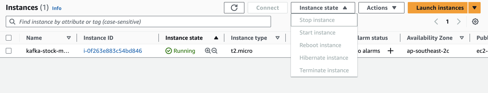

- When you try to connect to your EC2 instance after a day's time, and if the ssh is not working, Go to the aws management console, and restart the instance, and then try to connect to the instance.

- NOTE:
 - after you restart the instance, the public ip address will change, so you need to update the ip address in the ssh command, and then try to connect to the instance

 - also make sure to update the ip address in the server.properties file, and then start the kafka server
    - sudo nano config/server.properties

- if you change the ipaddress in cred.py, make sure you restart the jupyter notebook, and then run the code again, else it will not work and use the old ip address