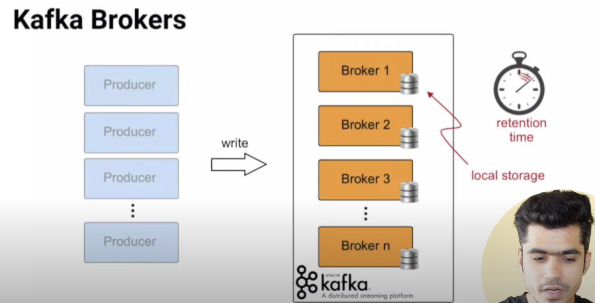
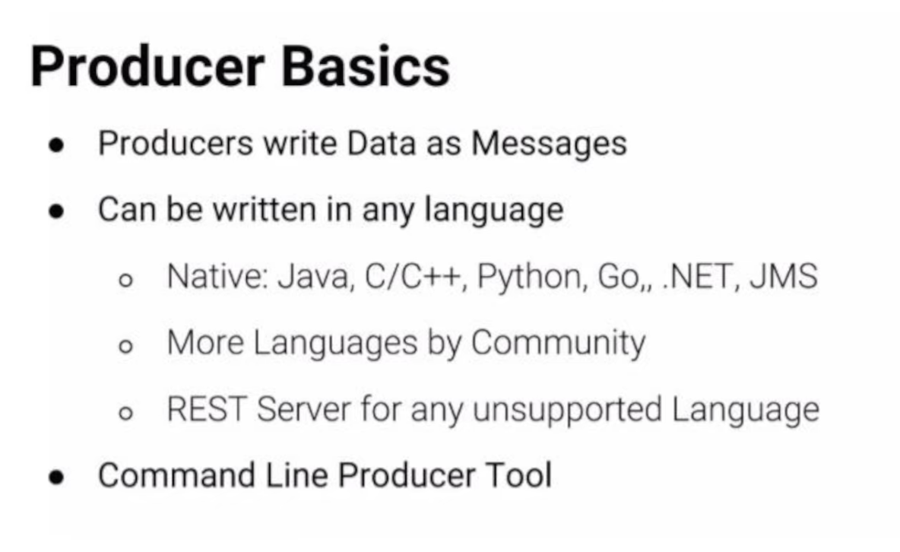

- Here we will take some stock market data and use it to demonstrate how to use Kafka
- We will use the stock market data from [Kaggle](https://www.kaggle.com/borismarjanovic/price-volume-data-for-all-us-stocks-etfs)

- we will consume the data from the csv file and produce it to a kafka topic
- we will then consume it and use AWS s3 to store the data
- then use AWS Athena to query the data
- Also use AWS Glue to create a crawler to crawl the data and create a table in the AWS Glue data catalog
- then use AWS Athena to query the data

# lets get started
- what is kafka?
    - kafka is a distributed streaming platform that is used publish and subscribe to streams of records , similar to a message queue or enterprise messaging system 
    - kafka is used for two broad classes of applications:
        - building real-time streaming data pipelines that reliably get data between systems or applications
        - building real-time streaming applications that transform or react to the streams of data
    - what is a stream?
        - a stream is a category or a topic name to which records are published
        - kafka stores streams of records in categories called topics
        - each record consists of a key, a value, and a timestamp 
        - kafka is run as a cluster on one or more servers that can span multiple datacenters
        - the kafka cluster stores streams of records in categories called topics
    - what is crawler?
        - a crawler is a program that visits web sites and reads their pages and other information in order to create entries for a search engine index
        - the major search engines on the web all have such a program, which is also known as a "spider" or a "bot"
        - crawlers are typically programmed to visit sites that have been submitted by their owners as new or updated
        - entire sites or specific pages can be selectively visited and indexed
    - AWS Glue data catalog
        - AWS Glue is a fully managed extract, transform, and load (ETL) service that makes it easy for customers to prepare and load their data for analytics
        - you can create and run an ETL job with a few clicks in the AWS Management Console
        - you simply point AWS Glue to your data stored on AWS, and AWS Glue discovers your data and stores the associated metadata (e.g. table definition and schema) in the AWS Glue Data Catalog
        - once cataloged, your data is immediately searchable, queryable, and available for ETL
        - AWS Glue generates the code to execute your data transformations and data loading processes
    - AWS Athena
        - Amazon Athena is an interactive query service that makes it easy to analyze data in Amazon S3 using standard SQL
        - Athena is serverless, so there is no infrastructure to manage, and you pay only for the queries that you run
        - Athena is easy to use
    

    

- What is ACK/NACK?
    -   If a signal is not ACKed (acknowledged) in the expected time, the signal is re-sent. A NACK is an explicit protocol message sent by a recipient to report that a specific, expected signal must be re-sent for some reason. A NACK is a negative acknowledgement. A NACK is a request for retransmission of data that was received garbled or not at all.
- What is a consumer group?
    - A consumer group is a set of consumers which cooperate to consume data from some topics. When you have multiple consumers, each consumer in the group is assigned a subset of the partitions from each topic that the consumer group is consuming. Each consumer within the group is assigned a different subset of partitions from the topics that it subscribes to so that each message is consumed by only one consumer in the group. If you have more consumers than partitions then some consumers will be idle and get no messages at all.

- How to setup AWS account?
    - https://youtu.be/kbtDJHgjrPc 
    - this will take just few minutes

- What is realtime stream engine?
    - it is a system that takes data from one or more sources and makes it available to subscribers in real-time

- what is distributed event store?
    - it is a database that stores events in the order in which they happened
- stream processing
    - it is a way of querying a stream of data in real-time
    - it is act of performing operations on data from a stream of data on a real-time basis

- 
    - web analytics
        - it is the measurement, collection, analysis and reporting of web data for purposes of understanding and optimizing web usage
        - however, web analytics is not just a process for measuring web traffic but can be used as a tool for business and market research, and to assess and improve the effectiveness of a website 
        - web analytics applications can also help companies measure the results of traditional print or broadcast advertising campaigns
        - it helps one to estimate how traffic to a website changes after the launch of a new advertising campaign

- Kafka brokers 
    - A Kafka cluster is composed of multiple brokers
    - Each broker is identified by a number
    - Each broker contains certain topic partitions
    - After connecting to any broker (called a bootstrap broker), you will be connected to the entire cluster
    - A good number to get started is 3 brokers, but some big clusters have over 100 brokers
    - one single kafka broker can handle hundreds of thousands of reads and writes per second and each broker can handle TB of messages without performance impact, 
    - one broker  is simply one kafka server  

- poll 
    - it is a method that is used to fetch data from kafka broker to consumer 
    - what happens when we poll?
        - when we poll, we get back a set of records (consumer records)
        - each record contains a key, a value and a timestamp
        - each record also has a topic name and a partition number
        

- zookeeper ensemble
    - zookeeper is a centralized service for maintaining configuration information, naming, providing distributed synchronization, and providing group services
    - all of these kinds of services are used in some form or another by distributed applications
    - each time a new broker comes up, it registers itself with zookeeper
    - each time a broker goes down, it deregisters itself with zookeeper
    - zookeeper knows which brokers are alive and which brokers are dead
    - zookeeper sends notifications to kafka in case of any changes
    - zookeeper is used to elect a controller
    - zookeeper by design operates with an odd number of servers (3,5,7)
    - zookeeper has a leader and the rest of the servers are followers 

- topics
    - a topic is a particular stream of data
    eg: stock prices, weather data, tweets
    - you can have as many topics as you want
    - a topic is identified by its name
    - topics are split in partitions
    - each partition is ordered
    - each message within a partition gets an incremental id, called offset
    - lets say we have a topic called stock_prices
    - we can have 3 partitions namely partition 0, partition 1 and partition 2
    - 
    - each partition will have its own offset
    - each partition will have its own set of messages
    - each partition will have its own leader
    - we can have topics like, added to cart, removed from cart, purchased, etc
    - so upon adding to cart, we can send a message to the added to cart topic and upon removing from cart, we can send a message to the removed from cart topic
    - and then we can have a consumer that consumes the messages from the added to cart topic and removed from cart topic and then we can have a consumer that consumes the messages from the purchased topic

- each and every log file is called a segment, and each segment is made up of many messages

- every data is replicated to 3 brokers
- every broker is a leader for some partitions and a follower for others
- when a leader goes down, one of the follower becomes the leader
- zookeeper decides which broker becomes the leader
- zookeeper knows which broker is alive and which broker is dead 
- zookeeper sends notifications to kafka in case of any changes
- zookeeper is used to elect a controller
- zookeeper by design operates with an odd number of servers (3,5,7)

- what is logfile?
    - a log file is a file that records either events that occur in an operating system or other software runs, or messages between different users of a communication software
    - logging is the act of keeping a log
    - in the simplest case, messages are written to a single logfile
    - many operating systems, software frameworks, and programs include a logging system
    - logging is performed by calling methods on instances of the Logger class in the logging module
    - the logger is configured to have a severity threshold
    - any message with a severity level equal to or higher than that threshold will be logged
    - the default severity threshold is WARNING, which means that only events of severity WARNING, ERROR, and CRITICAL will be tracked, while INFO and DEBUG messages will be ignored

- we will have static data
- stock market app simulates the stock market
- we will have a producer that will produce the data to kafka broker
- we will have a consumer that will consume the data from kafka broker and store it in s3
- s3 is a storage service provided by AWS and it is a distributed storage service , we can store any amount of data in s3 and it is highly available and durable, also any type of data can be stored in s3 and it is highly scalable
- we will have a crawler that will crawl the data from s3 and create a table in the AWS Glue data catalog
- we can  basically get the schema of the data from the crawler and then we can use AWS Athena to query the data

# lets start the project

- we will install kafka on ec2 instance and check the consumer and producer api